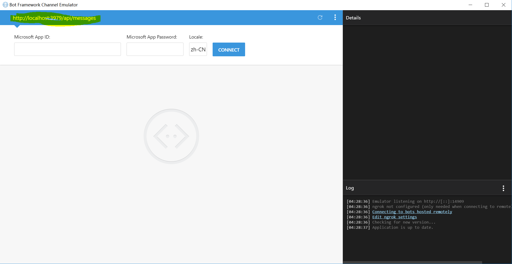
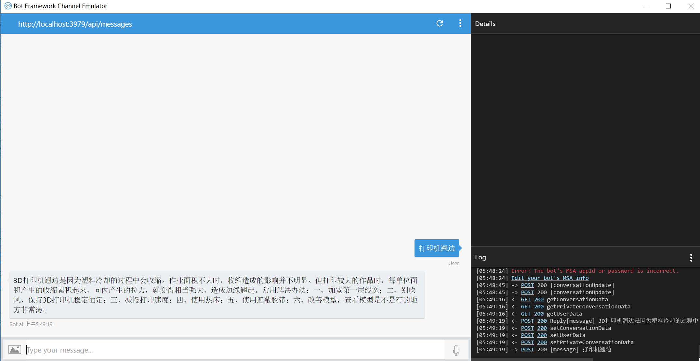
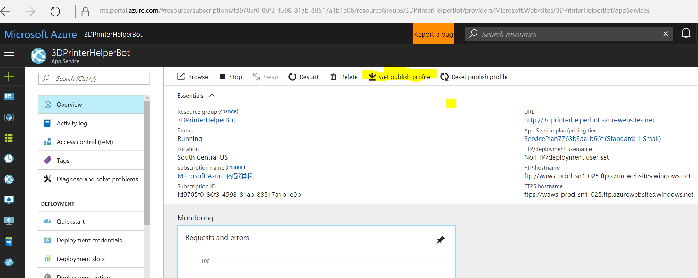
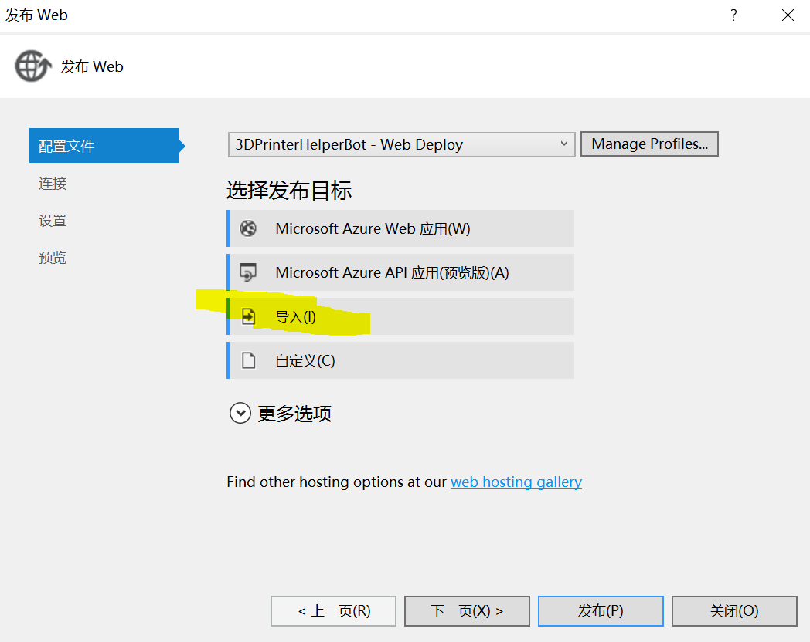
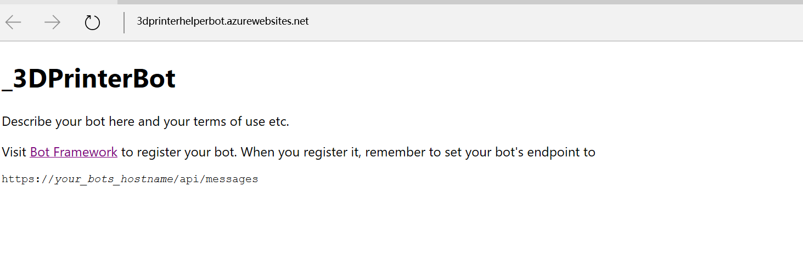
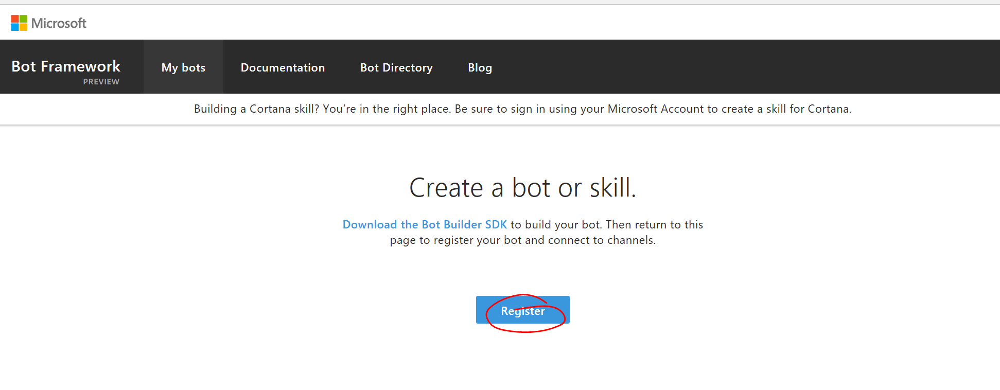
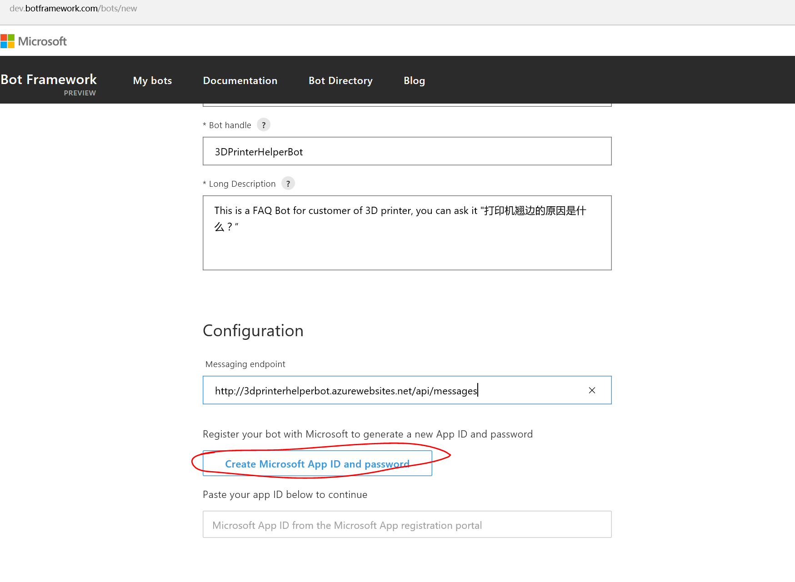
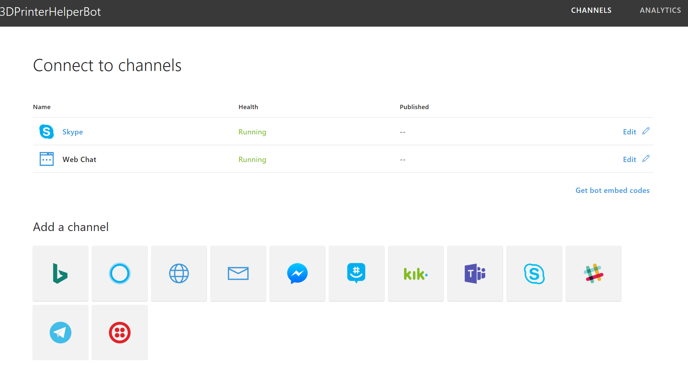
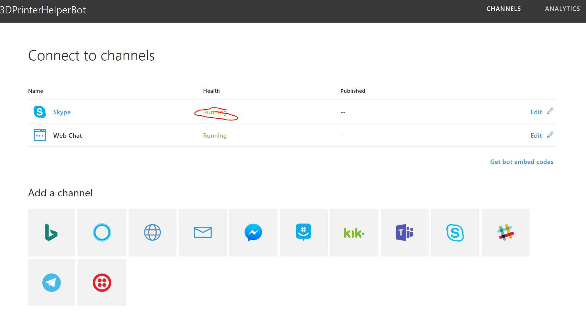
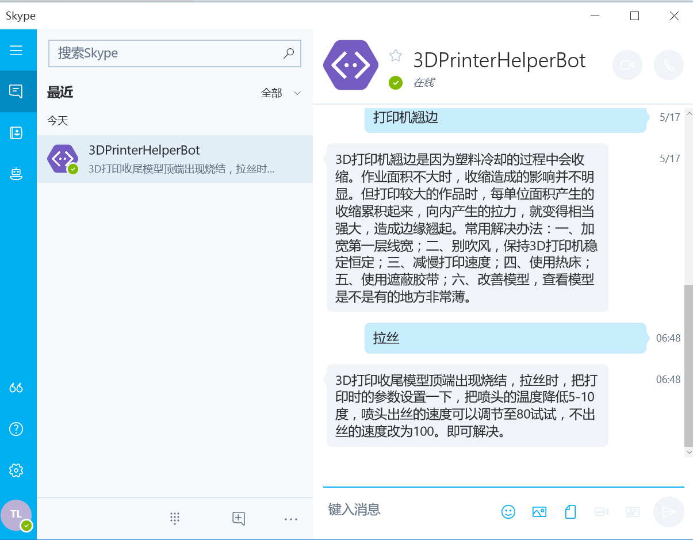

# 3DPrinterQnABot
3DPrinterQnABot将介绍如何使用[QnAMaker](htpp://qnamaker.ai)轻松创建一个问答帮助机器人的服务，并使用[Bot Framework](http://dev.botframework.com)集成该QnA服务实现一个可以在Skype/Web的机器人样例。本样例主要包括以下几部分内容：
- 创建QnA服务
- 创建3DPrinterQnABot
- 注册发布3DPrinterQnABot
- 测试3DPrinterQnABot

注： 该样例需要访问[QnAMaker](http://qnamaker.ai)和[Bot Framework](http://dev.botframework.com)，需要有Microsoft Account。

## 创建QnA服务 ##
QnAMaker可以让开发者使用FAQ URl，FAQ文件或者手工录入问题答案等方式，轻松构建一个问答机器人服务。访问[QnAMaker.ai](http://qnamaker.ai)，开始你的问答机器人的创建吧。

使用Microsoft Account登陆QnAMaker门户后，点击Create a new service，输入服务名称，和FAQ信息：FAQ URL， FAQ文件或者手工输入FAQ。这里我们选择使用FAQ 文件，如果使用FAQ文件，请注意必须是.tsv, .pdf, .doc, .docx文件，每个问答一行，中间用tab键空开（具体可以参考[FAQ Test](./FAQTest.tsv)，文件大小不能超过2M


QnA服务创建成后，就可以看到FAQ文件的问题被正确导入到QnA服务的Knowledge Base中， 此时也可以对问答信息再做编辑调整，如果没问题，就可以点击Save and Train，对Knowledge Base训练。


QnA服务训练完成后，就可以开始测试，点击test标签，进入测试页面， 可以输入之前FQA中相关问题，因为QnA后台是语义服务的支撑，因此这里不需要完全按照FQA中一样的问题提问，可以按照自然语言方式测试。


QnA服务测试通过后，就进入服务发布阶段，点击Publish，进入发布页面：


确认服务发布，服务即可发布，成功后可以看到成功信息，并显示QnA服务调用的Rest API调用信息。其中包括服务id和订阅id，见下图中标黄部分。这个是QnA服务调用的认证信息。


QnA服务发布成功，我们可以将该服务集成到BoT程序中，让它成为BoT的后台服务，提供问答服务。

## 创建3DPrinterQnABot ##
微软[BoT Framework](http://dev.botframework.com)为开发者提供BoT程序开发框架，可以使用Microsoft Account登陆BoT Framework官网，了解BoT应用开发相关内容。


其中 C# 开发者可以利用Visual Studio提供的Template创建BoT Application。Visual Studio Template下载安装，BoT应用创建可以访问[参考文档](https://docs.microsoft.com/en-us/bot-framework/dotnet/bot-builder-dotnet-quickstart)。
在Visual Studio中安装BoT Template后，就可以创建BoT应用，输入BoT Solution名称等信息。


BOT应用创建成功后，就可以开始BoT开发工作了，在这里说明以下该样例再BoT Framework框架中增加代码。
1. Web.config中的appSettings描述里增加QnA服务ID和订阅ID信息。
```
  <appSettings>
    <!-- update these with your BotId, Microsoft App Id and your Microsoft App Password-->
    <add key="BotId" value="3DPrinterHelperBot" />
    <add key="MicrosoftAppId" value="9820668a-xxxx-477f-xxxx-5dfa9de4d6b8" />
    <add key="MicrosoftAppPassword" value="T5xxxxxhqocaGfEgNg5aw71" />
    <add key="KnowledgeBaseId" value="eb3cb3e4-1ec1-4bc2-bcdd-xxxxxxxd3ac1"/>
    <add key="SubscriptionKey" value="2b24d6568d44451aafa0bb4xxxxxxx"/>
  </appSettings>
```
2. 创建QnAHelper.cs文件，封装调用QnA服务功能
```
using System;
using System.Collections.Generic;
using System.Linq;
using System.Web;
using System.Threading.Tasks;
using System.Net;
using System.Net.Http;
using System.Text;
using Newtonsoft.Json;

namespace _3DPrinterBot
{
    [Serializable]
    public class QnAHelper
    {
        public string KnowledgeBaseId { get; set; }
        public string SubscriptionKey { get; set; }
        public QnAHelper(string Id, string subscriptionKey)
        {
            KnowledgeBaseId = Id;
            SubscriptionKey = subscriptionKey;
        }

        public async Task<string> GetAnswer(string question)
        {
            if (string.IsNullOrEmpty(question))
            {
                return "Invalid question";
            }
            else
            {
                KBQuestion qItem = new KBQuestion();
                qItem.Question = question;
                return await KBPoster(qItem);
            }
        }

        private async Task<string> KBPoster(KBQuestion questionItem)
        {
            HttpClient client = new HttpClient();
            HttpContent content = new StringContent(JsonConvert.SerializeObject(questionItem), Encoding.UTF8, "application/json");
            client.DefaultRequestHeaders.Add("Ocp-Apim-Subscription-Key", SubscriptionKey);
            var result = await client.PostAsync(GetKBUriInternal(KnowledgeBaseId), content);
            var answerJson = await result.Content.ReadAsStringAsync();
            KBAnswer answer = null;
            try
            {
                answer = JsonConvert.DeserializeObject<KBAnswer>(answerJson);
            }
            catch (Exception ex)
            {
                string err = ex.ToString();
            }

            if (null == answer)
                return string.Empty;
            return answer.Answers[0].Answer;
        }

        private string GetKBUriInternal(string KnowledgeBaseId)
        {
            if (string.IsNullOrWhiteSpace(KnowledgeBaseId))
                return string.Empty;
            else
                return string.Format("https://westus.api.cognitive.microsoft.com/qnamaker/v2.0/knowledgebases/{0}/generateAnswer", KnowledgeBaseId);
        }
    }
}
```
3. 创建KBAnswer.cs和KBQuestion.cs，用来解析QnA服务返回的Jason结果。

4. 修改Bot Framework中RootDialog.cs代码，调用QnAHelper对象，完成QnA服务调用，代码如下：
```
using System;
using System.Threading.Tasks;
using Microsoft.Bot.Builder.Dialogs;
using Microsoft.Bot.Connector;
using System.Configuration;

namespace _3DPrinterBot.Dialogs
{
    [Serializable]
    public class RootDialog : IDialog<object>
    {
        private QnAHelper _helper = null;

        public RootDialog()
        {
            AppSettingsReader reader = new AppSettingsReader();
            string Id = reader.GetValue("KnowledgeBaseId", typeof(string)).ToString();
            string subscriptionKey = reader.GetValue("SubscriptionKey", typeof(string)).ToString();
            _helper = new QnAHelper(Id, subscriptionKey);
        }

        public Task StartAsync(IDialogContext context)
        {
            context.Wait(MessageReceivedAsync);

            return Task.CompletedTask;
        }

        private async Task MessageReceivedAsync(IDialogContext context, IAwaitable<object> result)
        {
            var activity = await result as Activity;
            // return our reply to the user
            string answer = await _helper.GetAnswer(activity.Text);
            activity.Text = answer;
            await context.PostAsync(activity.Text);

            context.Wait(MessageReceivedAsync);
        }
    }
}

```
## BoT 应用测试 ##
BoT应用代码编译完成后，可以开始BoT测试，需要参考[C# BoT开发]((https://docs.microsoft.com/en-us/bot-framework/dotnet/bot-builder-dotnet-quickstart)中描述，下载[BoT Emulator](https://docs.microsoft.com/en-us/bot-framework/debug-bots-emulator)，
按照文档中说明，在Visual Studio中Debug你的Bot程序，在BoT Emulator中配置你本地BoT应用测试地址，可以开始调试。


在BoT Emulator中输入测试的问题，检查返回的结果是否正确。


## 注册发布BoT应用 ##
BoT应用测试完成后就可以进行注册发布，可以选择发布BoT Framework支持的Connector上，方便用户使用。这里我们以发布在Skype和WebChat上为例。

1. BoT应用注册之前，需要将BoT 应用发布到web site上，用户可以选择发布到自己的IIS服务器上，有Azure 订阅的用户客户发布到Azure Website服务上，这里以Azure Website为例。
- 在Azure Portal上创建Web site服务成功后，进入website服务点击 Get publish profile，下载发布配置文件。


- 在Visual Studio中，点击Bot应用的工程的右键，点击发布，选择配置文件标签，点击导入，将1步中下载的发布配置文件导入到visual studio中，然后下一步，最后点击发布


- 应用发布成功后，可以通过域名访问，如该例发布为：http://3dprinterhelperbot.azurewebsites.net/


可以开始注册BoT了

2. 登陆[BoT Framework](http://dev.botframework.com)，使用Microsoft Account登陆，开始Bot注册。
- 点击My bots， 如果你第一次访问，会提示你还没有bot，是否需要注册，点击register。


- 输入BoT相关信息，其中message endpoint处填写发布在website上BoT应用URL，选择创建AppID和Password。保存好AppID和Password，在后面程序中需要使用。


- BoT注册的最后是选择要发布的Connnect，这里选择Skype和Webchat，可以做测试，通过后就可以提交。


3. 可以在Skype里面和你的BoT聊天了。
- 点击Skype的Running， 可以启动Skype。


- 在Skype里面测试你的BoT


