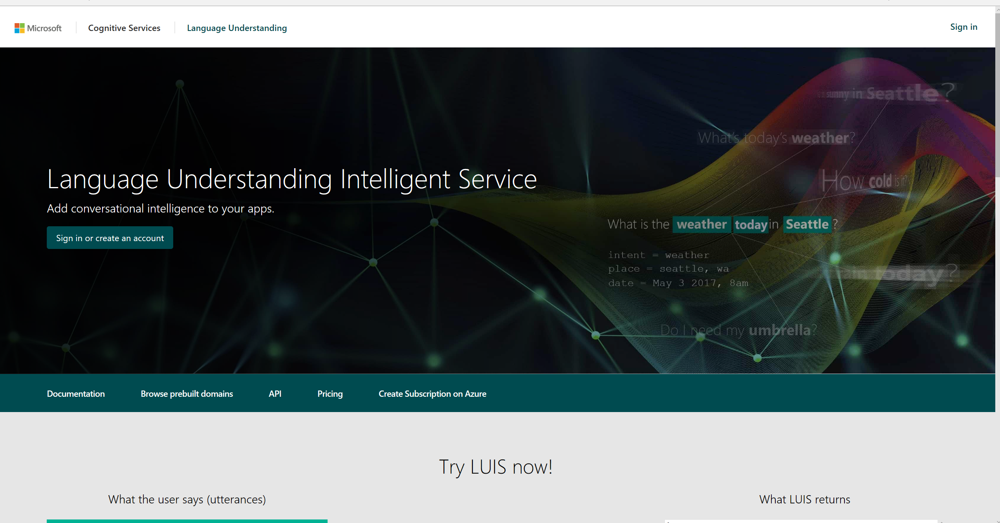
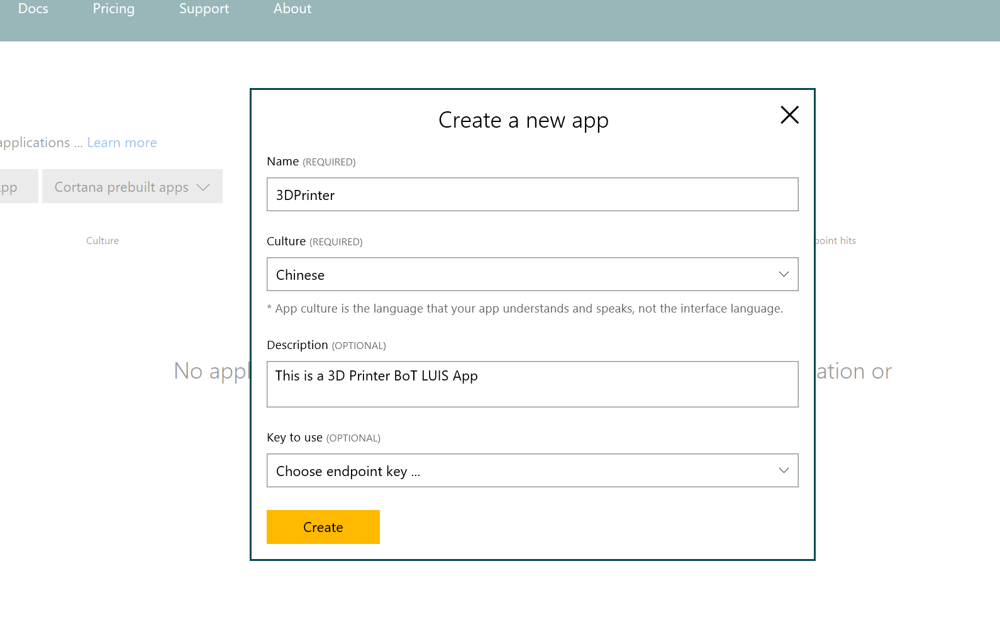
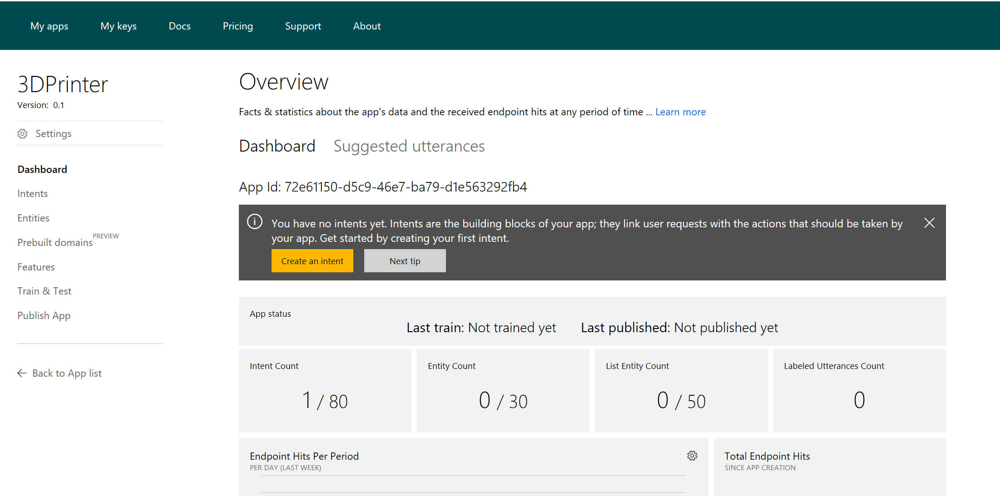
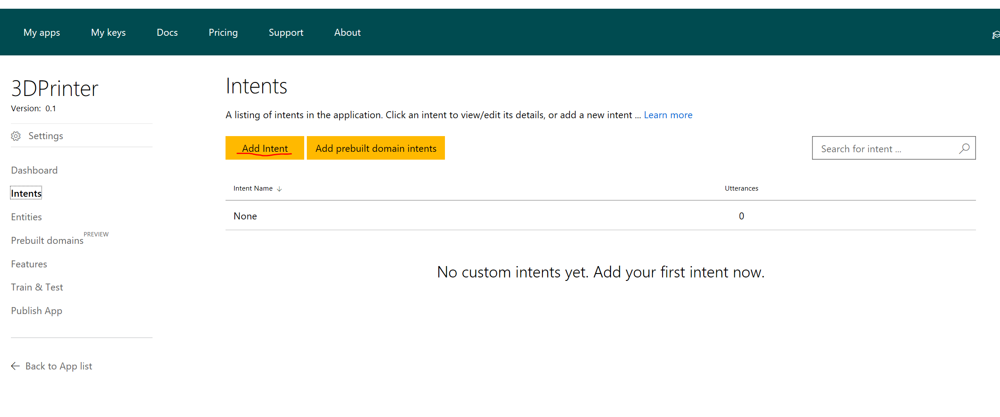
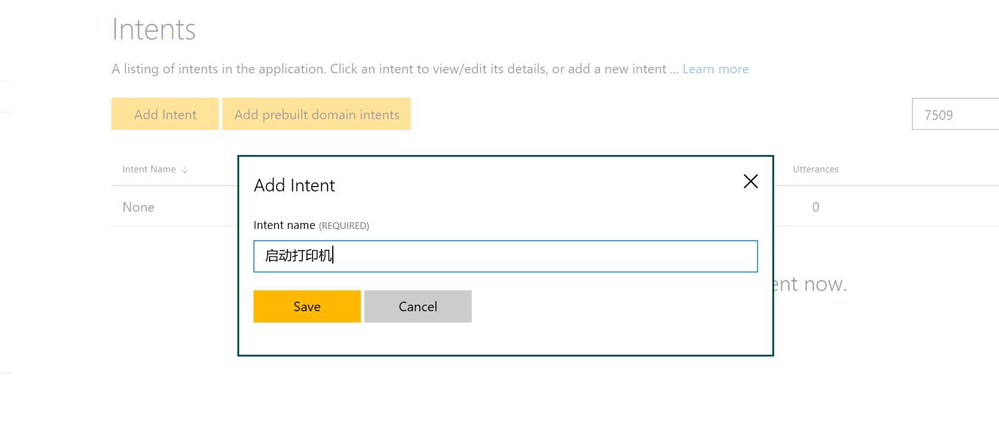
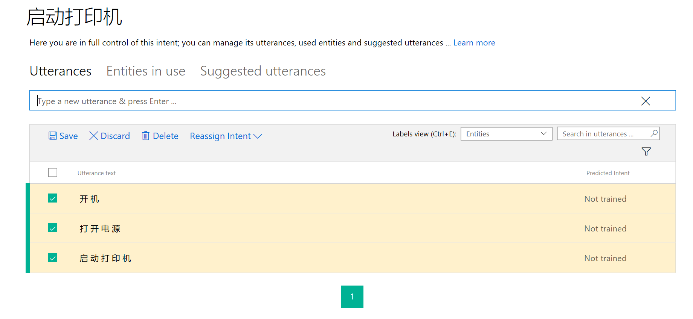

# 3DPrinterLUIS
3DPrinterLUIS项目是一个针对3D打印机机器人的语义应用的样例，主要介绍如何使用[luis.ai](https://www.luis.ai)生成语义App，创建意图，训练意图并发布语义App REST API给其他应用服务调用。该样例将包括以下内容：
- 创建语义应用
- 创建意图/语料
- 创建实例
- 训练与测试意图
- 发布语义应用
该样例需要使用[微软认知服务](https://azure.microsoft.com/zh-cn/services/cognitive-services/)中语义服务，需要申请免费使用账号或者购买Azure.com的订阅。
## 创建语义应用 ##
微软认知服务中的语义服务为开发者提供了自己训练业务场景语义的工具，开发者可以自己独立完成语义应用的搭建和训练。访问[luis.ai](https://www.luis.ai)，使用已有的Azure订阅账号注册或者使用Microsoft Account注册申请免费试用账号登陆。

登陆LUIS门户后，进入MyApp页面，点击New App，创建你的LUIS应用，输入应用名称，语种，描述等信息，先保留密钥部分为空，后面发布环节，再做详细介绍，输入完成后点击创建。

应用创建成功后，直接进入应用的Dashboard页面，以后开发者可以在此看板中查看应用的使用情况。

## 创建意图/语料 ##
应用创建完成后，就可以开始为系统创建意图并输入要训练的语料，点击添加意图，如“启动打印机”。

保存后，进入语料界面，输入该意图的相关语料，如“启动打印机”，“开机”，“打开电源”，输入后点击保存语料。

这里创建的意图是无参数的指令，如果客户希望输入带参数的意图，例如设置打印材料，设置打印模式等，这时创建意图语料同时，还需要创建实例（即意图参数）。
## 创建实例 ##
按照上面意图创建完成设置打印材料意图创建，并输入语料“使用树脂打印”，回车后，在语料文本中，使用鼠标双击你需要定义的实例文本，如这里是树脂。然后输入实例名称“材料”，点击创建实例按钮，即可完成实例创建。

需要为所有需要实例的语料创建或者配置指定的实例。

此外，LUIS模型中提供预定义的实例，如时间，数字，百分比，年龄等，当你需要的语料实例是预定义实例时，就不用创建这些实例类型，直接录入语料就可以自动识别这些实例。

## 训练与测试意图 ##
完成意图与语料的输入后，即可开始训练。点击训练与测试，进入训练界面，点击训练

训练完成后，可以输入测试的语料，测试意图训练的结果。例如输入“开机”，测试结果显示识别该语料的意图结果“启动打印机”，信心指数为0.95
可以持续的添加意图，语料之后再进行训练测试。
## 发布语义应用 ##
完成所有训练和测试，就可以发布语义应用，提供给需要使用本应用解析意图的应用使用了。 点击发布菜单，进入语义应用发布页面，正式发布应用就需要LUIS的访问密钥了。这里介绍使用Azure订阅在[Azure Portal](http://portal.azure.com)中创建LUIS服务并获得Key。
登陆[Azure Portal](http://portal.azure.com)后， 点击创建，选择AI+Cognitive Services，点击Language Understanding，然后点击Create。

输入LUIS服务名称等信息，选择计价模式，为了方便使用，可以选择将该服务钉在管理页面上。

创建完成，进入管理首页，就可以看到刚刚创建的LUIS服务3DPrinterLUISAPI，点击进入该服务，在服务信息列表中点击Key，进入密钥管理页面，选择拷贝Key1或者Key2. 注意创建新密钥需要最多10分钟的生效时间， 如果将密钥配置到语义应用时报错，可以稍等几分钟就生效了。 

获取密钥后， 进入LUIS语义应用发布页面， 选择添加密钥，输入密钥信息和名称，然后点击保存。

密钥添加成功，选择使用该密钥，然后就可以发布应用，点击发布。发布成功后，回生成应用访问的REST API 的Endpoint url，点击该URL可以进行测试。

在URL后面添加需要测试语料信息，如图
(./images/image23.PNG)
调用返回LUIS语义应用处理结果，如图
(./images/image24.PNG)
## 总结 ##
LUIS提供给开发者独立完成语义训练环境和服务，利用它可以作为BoT的意图处理中心，实现自己的人工智能服务。 